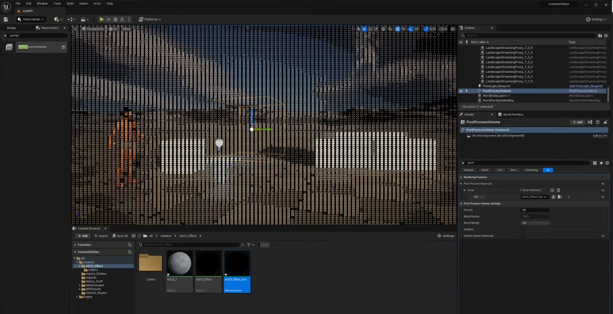

# ASCii War




**ASCii War** - сетевая игра, клон Counter-Strike, использующая для отрисовки 
символы таблицы ASCii. Игра основа на движке Unreal Engine 5.2. Особенностью 
игры является графика с использованием символов ASCii

# Системные требования

## МИНИМАЛЬНЫЕ:
**ОС**: Windows 7 / 8 / 10 / 11 64 bit\
**Процессор**: Intel Core i3-7350K (4.20 GHz) or better\
**Оперативная** память: 8 GB ОЗУ\
**Видеокарта**: AMD Radeon RX 470\
**DirectX**: Версии 11


## РЕКОМЕНДОВАННЫЕ:
**ОС**: Windows 10 / 11 64 bit\
**Процессор**: Intel Core i5-4590 (3.70 GHz) or better\
**Оперативная** память: 8 GB ОЗУ\
**Видеокарта**: Nvidia GeForce GTX 970\
**DirectX**: Версии 11

## Как играть

Для запуска выделенного сервера необходимо выполнить команду
```
./ASCiiWarServer.exe -PlayTestMap
```

Для подключени к серверу необходимо выполнить команду
```
./Client.exe %АДРЕС СЕРВЕРА:7777%
```

## Об Игре
На данном этапе тестирования в игре есть только одна карта - PlayTestMap\

Для отладки механик было добавлено следующее оружие\
1. Штурмовые винтовки
    * [M4A1](https://ru.wikipedia.org/wiki/M4_(%D0%B0%D0%B2%D1%82%D0%BE%D0%BC%D0%B0%D1%82)) - высокая скорострельность, средний урон
    * [АК](https://ru.wikipedia.org/wiki/%D0%90%D0%B2%D1%82%D0%BE%D0%BC%D0%B0%D1%82_%D0%9A%D0%B0%D0%BB%D0%B0%D1%88%D0%BD%D0%B8%D0%BA%D0%BE%D0%B2%D0%B0) - Скорострельность ниже, чем у М4А1, урон выше
1. Пистолеты-пулеметы
    * [H&K MP7](https://ru.wikipedia.org/wiki/HK_MP7)
    * [СР-2М Вереск](https://ru.wikipedia.org/wiki/%D0%A1%D0%A0-2)
1. Дробовики
    * [МР-133](https://ru.wikipedia.org/wiki/MP-133) - помповый дробовик
    * [Сайга-12](https://ru.wikipedia.org/wiki/%D0%A1%D0%B0%D0%B9%D0%B3%D0%B0-12) - самозарядное ружье
1. Снайперские винтовки
    * [Винтовка Мосина](https://ru.wikipedia.org/wiki/%D0%92%D0%B8%D0%BD%D1%82%D0%BE%D0%B2%D0%BA%D0%B0_%D0%9C%D0%BE%D1%81%D0%B8%D0%BD%D0%B0) - винтовка со скользящим затвором
    * [СВД](https://ru.wikipedia.org/wiki/%D0%A1%D0%BD%D0%B0%D0%B9%D0%BF%D0%B5%D1%80%D1%81%D0%BA%D0%B0%D1%8F_%D0%B2%D0%B8%D0%BD%D1%82%D0%BE%D0%B2%D0%BA%D0%B0_%D0%94%D1%80%D0%B0%D0%B3%D1%83%D0%BD%D0%BE%D0%B2%D0%B0) - самозарядная винтовка
1. Пистолеты
    * [FN Five-SeveN](https://ru.wikipedia.org/wiki/FN_Five-seveN)
    * [M1911](https://ru.wikipedia.org/wiki/M1911)

> ### Комментарий от команды разработчиков
> Весьма вероятно, что реально существующие образцы оружия придется заменить
> на нечто похожее на реальное оружие, но имеющее другое название.
> (Никто не хочет платить) 
 
### Информация об оружии

| Оружие        | Калибр  | Урон (в тело) | Скорострельность в мин |
|:-------------:|:-------:|:-------------:|:----------------------:|
|M4A1           |5.56x45  | 40            |  700                   |
|AK             |7.62x39  | 44            |  600                   |
|H&K MP7        |4.6x30   | 35            |  750                   |
|СР-2М Вереск   |9x21     | 35            |  750                   |
|МР-133         |12/70    | 13(8 дробинок)|  70                    |
|Сайга-12       |12/70    | 10(8 дробинок)|  180                   |
|Винтовка Мосина|7.62х54R | 143           |  40                    |
|СВД            |7.62х54R | 95            |  250                   |
|FN Five-SeveN  |5.7x28   | 39            |  500                   |
|M1911          |.45 ACP  | 43            |  400                   |
